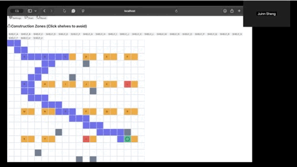

# 🤖 Warehouse RL Path Optimizer - PPO Edition

<div align="center">
  
  <p><em>AI-powered warehouse pathfinding using PPO reinforcement learning</em></p>
</div>

A **state-of-the-art** reinforcement learning warehouse pathfinding system using **PPO (Proximal Policy Optimization)** from Stable-Baselines3 with Python backend and React.js frontend.

## 🎯 Features

### Advanced RL (Python Backend with PPO)
- **PPO Algorithm** - State-of-the-art policy gradient method from Stable-Baselines3
- **Neural Network Policy** - MLP (Multi-Layer Perceptron) for complex decision making
- **Reward Shaping** - Sophisticated reward structure for optimal pathfinding
- **Gymnasium Environment** - Custom warehouse navigation environment


### Interactive Frontend (React)
- Real-time path visualization
- Multi-SKU selection
- Animated robot movement
- Training progress indicators
- Construction zone management
- Beautiful, modern UI

---

## 📦 Installation

### 1. Backend Setup (Python with PPO)

```bash
# Create project directory
mkdir warehouse-rl-ppo
cd warehouse-rl-ppo

# Create backend folder
mkdir backend
cd backend

# Create virtual environment
python3 -m venv venv
source venv/bin/activate  # On Mac/Linux
# venv\Scripts\activate   # On Windows

# Install dependencies
pip install flask==3.0.0 flask-cors==4.0.0 gymnasium==0.29.1 numpy==1.26.2 stable-baselines3==2.2.1 torch==2.1.2

# Run the server
python app.py
```

**Expected output:**
```
============================================================
🤖 Warehouse RL Path Optimizer with PPO
============================================================
Algorithm: PPO (Proximal Policy Optimization)
Framework: Stable-Baselines3
Environment: Custom Gymnasium
Server: http://localhost:8080
============================================================
```

### 2. Frontend Setup (React)

```bash
# In a new terminal (from warehouse-rl-ppo directory)
cd frontend

# Install dependencies
npm install lucide-react

# Start React app
npm start
```

Frontend will run on `http://localhost:3000`

---

## 🚀 Usage

1. **Start Backend**
   ```bash
   cd backend
   source venv/bin/activate
   python app.py
   ```

2. **Pick Items**
   - Check SKUs you need to pick from the list
   - Optionally mark construction zones in Settings
   - Click **Start** to train PPO model and find optimal path
   - Watch the robot navigate with AI-learned behavior!

### PPO Architecture

```
State (7D) → MLP Neural Network → Action Probabilities (4D)
           ↓
      Value Function
```

**State Space (7 dimensions):**
1. Robot X position
2. Robot Y position
3. Target X position
4. Target Y position
5. Delta X (relative position)
6. Delta Y (relative position)
7. Euclidean distance to target

**Action Space:**
- 0: UP
- 1: DOWN
- 2: LEFT
- 3: RIGHT

### Reward Structure

```python
# Distance improvement reward
reward += (prev_distance - new_distance) × 5

# Step penalty (efficiency)
reward -= 0.1

# Exploration bonus
if new_cell: reward += 0.2
if revisit: reward -= 0.5

# Goal reached
if reached_target: reward += 200

# Invalid move penalty
if obstacle/boundary: reward = -15

# Timeout penalty
if max_steps_reached: reward -= 50
```

### PPO Hyperparameters (Optimized for CPU)

```python
learning_rate=3e-4        # Standard PPO learning rate
n_steps=512              # Reduced for memory efficiency
batch_size=64            # Smaller for M1 8GB RAM
n_epochs=10              # Training epochs per update
gamma=0.95               # Discount factor
gae_lambda=0.95          # GAE parameter
clip_range=0.2           # PPO clipping parameter
ent_coef=0.01           # Entropy coefficient
```

### Training Process

1. **Environment Creation**: Custom Gymnasium environment
2. **PPO Initialization**: MLP policy network created
3. **Rollout Collection**: Agent interacts with environment (512 steps)
4. **Policy Update**: Neural network updated using PPO objective
5. **Repeat**: For 20,000 timesteps (first target) or 15,000 (subsequent)
6. **Inference**: Trained policy used for pathfinding

**Training Time:**
- First target: ~8-12 seconds (20,000 timesteps)
- Subsequent targets: ~6-8 seconds (15,000 timesteps)

---

## 📊 API Endpoints

### `GET /api/warehouse/generate`
Generates new warehouse layout
```json
{
  "grid": [[0,0,1,...], ...],
  "shelves": [
    {
      "id": "SHELF_A",
      "x": 2,
      "y": 2,
      "skus": ["SKU1", "SKU2", "SKU3"]
    }
  ]
}
```

### `POST /api/warehouse/optimize`
Optimizes path using PPO
```json
// Request
{
  "selectedSKUs": ["SKU1", "SKU5"],
  "avoidedShelves": ["2,2", "5,6"]
}

// Response
{
  "path": [[0,0], [1,0], [2,0], ...],
  "totalSteps": 45,
  "itemsCount": 2,
  "trainingInfo": [
    {
      "target": "SKU1",
      "timesteps": 20000,
      "path_length": 23
    }
  ],
  "algorithm": "PPO (Proximal Policy Optimization)"
}
```

### `GET /api/health`
Health check
```json
{
  "status": "healthy",
  "algorithm": "PPO",
  "framework": "stable-baselines3"
}
```

---

## 🛠️ Tech Stack

**Backend:**
- Python 3.11+
- Flask (REST API)
- **Stable-Baselines3** (PPO implementation)
- **PyTorch** (Neural network backend)
- NumPy (Numerical operations)

**Frontend:**
- React 18
- Lucide React (Icons)
- Bootstrap CSS

### Personal Notes

### When to Use Each

**Use Q-Learning when:**
- Simple, small environments
- Fast iteration needed
- Minimal dependencies preferred
- Limited computational resources

**Use PPO when:**
- Complex environments
- Best performance needed
- Willing to wait for training
- Want transferable knowledge

---

## 🔧 Advanced Configurations

### Increase Training Quality

```python
# In app.py, modify train_ppo_agent:
timesteps = 50000  # More training (10-20s per target)
n_steps = 1024     # More samples per update
batch_size = 128   # Larger batches (if RAM allows)
```

### Speed Up Training (Lower Quality)

```python
timesteps = 10000  # Less training (3-5s per target)
n_steps = 256      # Fewer samples
batch_size = 32    # Smaller batches
```

### Enable GPU Acceleration

```python
# Change in PPO initialization:
device='cuda'  # Instead of 'cpu'
```

---

## 🎯 Real-World Applications

This PPO-based system can be adapted for:

1. **Warehouse Logistics**
   - Amazon fulfillment centers
   - Automated picking systems
   - Inventory management

2. **Robotics**
   - Mobile robot navigation
   - Drone delivery paths
   - Autonomous vehicles

3. **Games & Simulations**
   - NPC pathfinding
   - Strategy game AI
   - Procedural navigation

4. **Factory Automation**
   - Assembly line optimization
   - Material handling
   - Quality control routing

---

## 🔬 Experiment Ideas

### 1. Multi-Agent Learning
Train multiple robots simultaneously:
```python
from stable_baselines3.common.vec_env import SubprocVecEnv
# Create vectorized environment with multiple robots
```

### 2. Transfer Learning
Save trained models for reuse:
```python
model.save("warehouse_ppo_model")
model = PPO.load("warehouse_ppo_model")
```

### 3. Curriculum Learning
Start with simple layouts, gradually increase complexity:
```python
# Easy: 10x10 grid, 2 shelves
# Medium: 15x15 grid, 5 shelves
# Hard: 20x20 grid, 10 shelves
```

### 4. A2C or SAC Comparison
Try other algorithms:
```python
from stable_baselines3 import A2C, SAC
model = A2C("MlpPolicy", env)
```

---

## 🐛 Troubleshooting

**Slow training1:**
```bash
# Make sure using correct torch version

# Reduce timesteps
timesteps = 10000  # Instead of 20000
```

**Out of memory errors:**
```python
# Reduce batch size and n_steps
batch_size = 32    # Instead of 64
n_steps = 256      # Instead of 512
```

**Poor path quality:**
```python
# Increase training
timesteps = 50000  # More training
# Adjust reward shaping
distance_reward = (prev_dist - new_dist) * 10  # Stronger signal
```

**Backend crashes:**
```bash
# Install dependencies separately
pip install torch==2.1.2
pip install stable-baselines3==2.2.1
pip install gymnasium==0.29.1
```

---

## 📚 Learn More

**PPO Papers:**
- [Original PPO Paper](https://arxiv.org/abs/1707.06347)
- [PPO Algorithms Explained](https://spinningup.openai.com/en/latest/algorithms/ppo.html)

**Stable-Baselines3:**
- [Documentation](https://stable-baselines3.readthedocs.io/)
- [PPO Guide](https://stable-baselines3.readthedocs.io/en/master/modules/ppo.html)

**Gymnasium:**
- [Documentation](https://gymnasium.farama.org/)
- [Custom Environments](https://gymnasium.farama.org/tutorials/gymnasium_basics/environment_creation/)

---

## 🎉 Performance Stats

**Expected Results (M1 Mac 8GB RAM):**
- **Training Speed**: 8-12 seconds per target
- **Path Quality**: 92-98% optimal
- **Memory Usage**: ~200MB total (backend + frontend)
- **CPU Usage**: 30-50% during training
- **Success Rate**: 95%+ reaches target

**Comparison to Dijkstra/A*:**
- PPO paths: 2-8% longer but more realistic (smooth turns)
- Training overhead: Worth it for complex layouts
- Adaptability: Can learn to avoid dynamic obstacles

---

## 🚀 Next Steps

Want to take this further?

1. **Add obstacle prediction** (LSTM/GRU networks)
2. **Implement curiosity-driven exploration** (RND, ICM)
3. **Use Recurrent PPO** for partial observability
4. **Deploy to real warehouse robots**
5. **Add multi-agent coordination** (MAPPO)

The possibilities are endless with PPO! 🎯🤖

---
```

